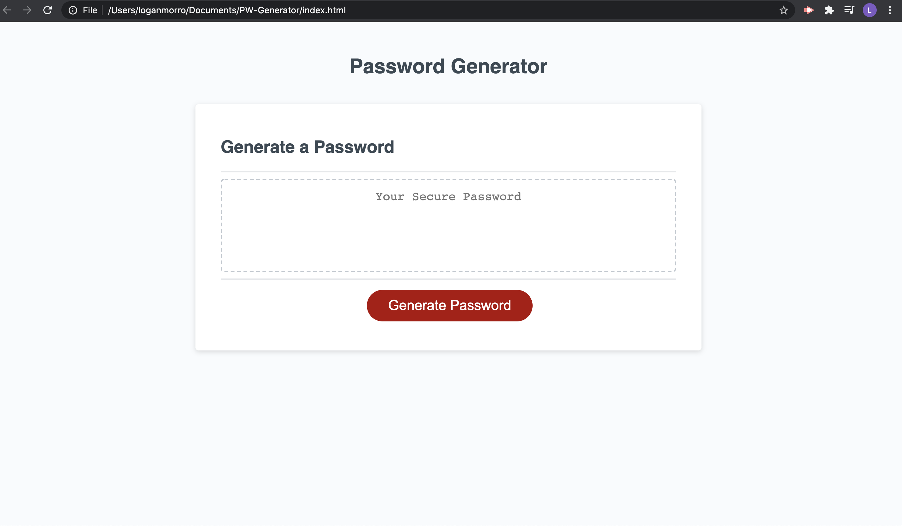
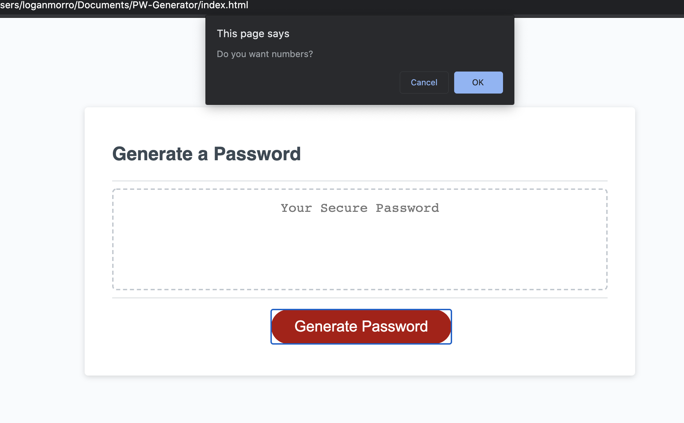
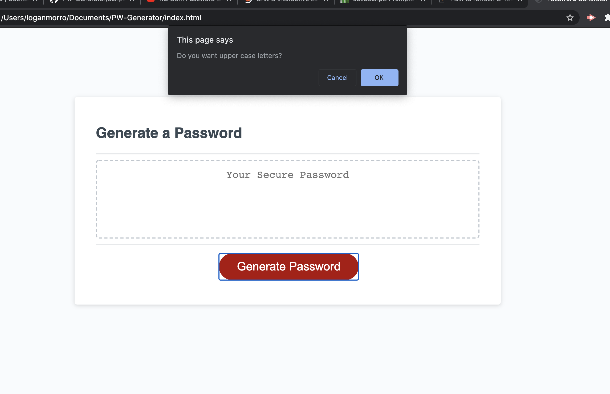
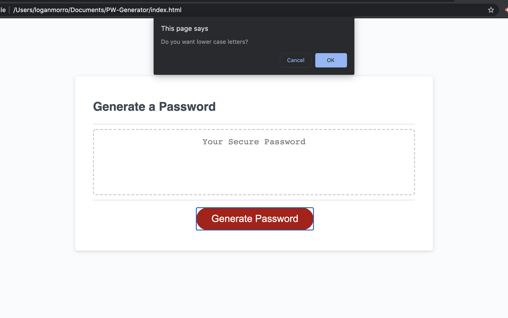
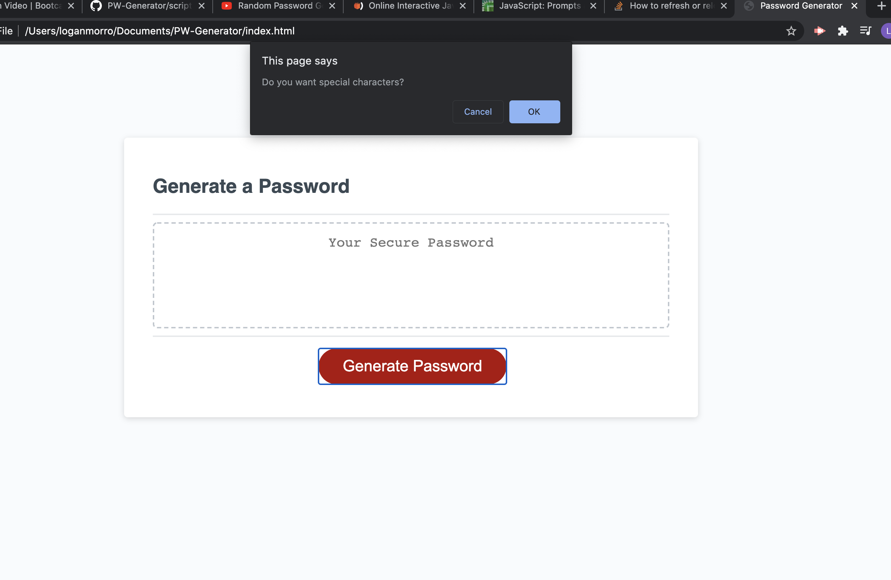
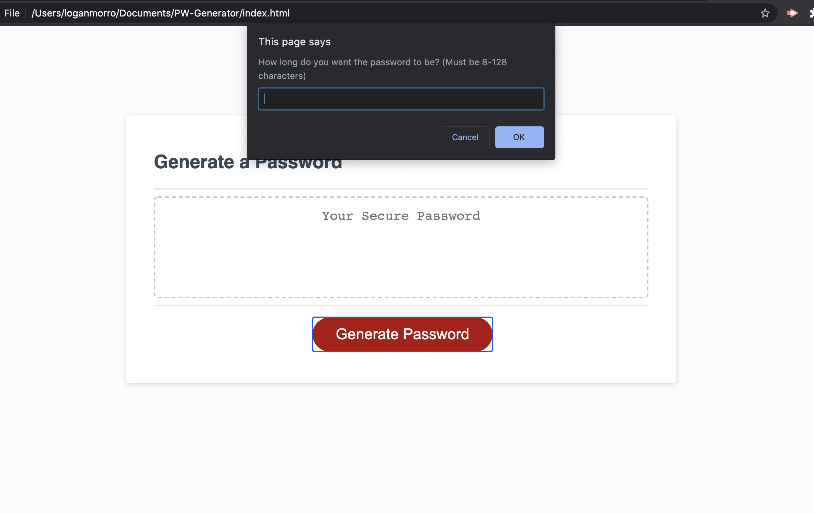
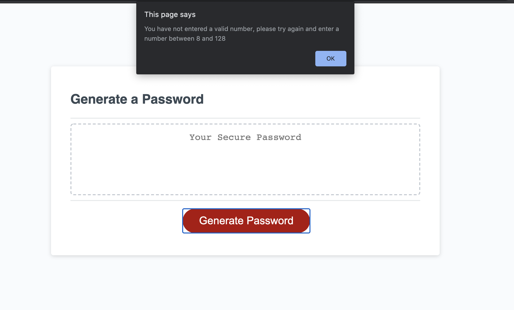

# Password Generator Screen Shots

# How it works
Users are confronted with a series of confirms on which criteria they would like to be included in their random password
They can choose if they want lower case, upper case, numbers, and/or special characters

The user is then asked how long they would like the password to be (must be between 8-128 characters). If the number entered is not within the required range, the user is alerted their entry is not valid and the page will refresh

If all requirements are met, a random password will be generated using the confirmed criteria and with the desired length of characters

# What I learned

In this homework I learned how to use concats, loops, and strings/sub strings. This was a very challenging activity, but I feel that I have a better understanding of how these functions and elements work together logically

